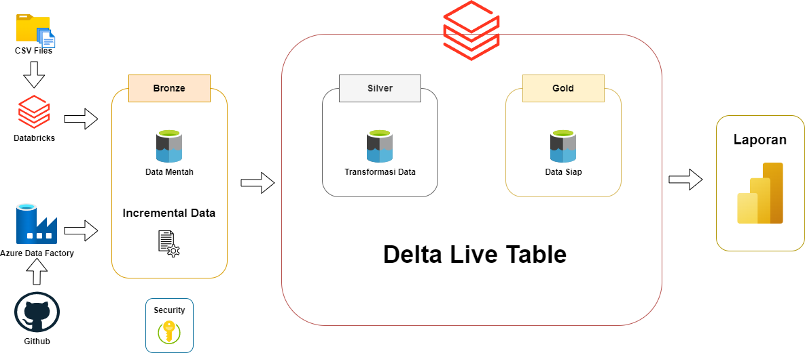

# Azure End-to-End Data Engineer Project
Proyek ini mendemonstrasikan solusi data pipeline cloud dengan meggunakan Azure. Dirancang sebagai proyek portofolio, proyek ini menyoroti praktik membangun data pipeline menggunakan arsitektur medali. Menggunakan Azure Data Factory untuk menarik data dari sistem sumber. Lalu, menarik data dari Azur Data Lake Storage secara inkremental dengan Auto Loader menggunakan Databricks. Melakukan transformasi dengan PySpark dan Databricks Workflow Activities untuk membuat notebook dinamik yang diparameterisasi (scheduling). Terakhir, menggunakan Delta Live Table untuk membuat lapisan gold.

## Data Architecture
Arsitektur data untuk proyek ini mengikuti Arsitektur Medali, lapisan **Bronze**, **Silver**, dan **Gold**:

## Technology Stack

- **Azure Data Factory (ADF)**: Untuk orkestrasi pemindahan data.
- **Azure Data Lake Storage (ADLS)**: Untuk menyimpan baik data mentah maupun data yang telah diproses.
- **Azure Databricks**: Alat serbaguna untuk menarik data secara inkremental, transformasi, dan juga otomatisasi.
- **Power BI**: Untuk visulisasi data dan laporan.
- **Azure Key Vault**: Untuk mengelola kredensial dan rahasia dengan aman.